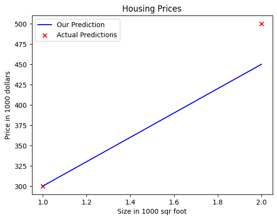

# logistic-regression-training

### Overview
- Popular Home Features example for basic understanding of the Logistic Regression
- After that, we will move forward to [Iris Dataset](https://archive.ics.uci.edu/dataset/53/iris) 

#### Single Feature: Logistic Regression using Model Funtion
- Currently, if you take an example of housing dataset: 
    | Size (1000 sqft) | Price (1000s of dollars) |
    |------------------|--------------------------|
    | 1.0              | 300                      |
    | 2.0              | 500                      |

- Implemented the logistic regression by specifically defining the model function. Instead of using the **scikit_learn**. As, for learning purposes to have deeper knowledge of how the things work at the underlying level.
- Used **NumPy**, and **Matplotlib**

- A basic overview is that made separate **np.array**'s for the x_train(Size of house), and y_train(Price of house)

- Then, printed the shape of both to see the dimension of the data

- Simply used the scatter plot on base dataset values:
  Here size of the house was on x-axis, with price of house on the y-axis
  

- Defined the function **compute_model_output(x_train, w, b)** in which the model function was there for the predicting the price based on **x_train**:
  ```python
  f_wb[i] = weight * x[i] + bias
  ```

- Now the function **compute_model_output(x_train, w, b)** will plot the predicted values (prices) on the already placed data points on Scatter plot:
  


### Dataset

[Iris Dataset](https://archive.ics.uci.edu/dataset/53/iris)