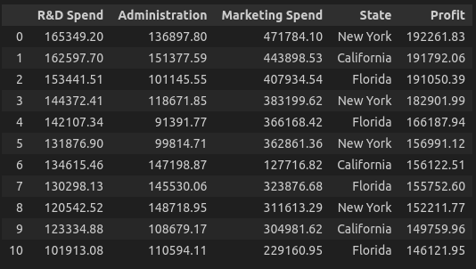
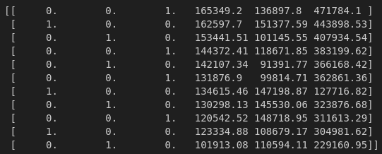
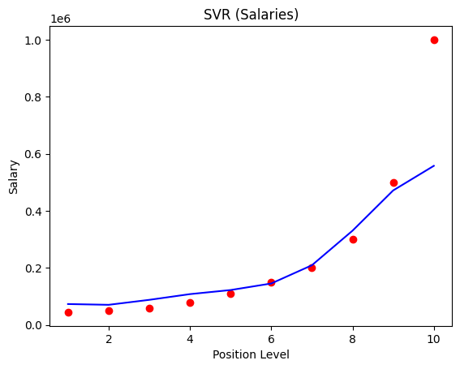

# Logistic Regression Training

### Overview
- Popular Home Features example for basic understanding of the Logistic Regression
- After that, we will move forward to [Iris Dataset](https://archive.ics.uci.edu/dataset/53/iris) 

### Single Feature: Linear Regression using Model Function
- Currently, if you take an example of housing dataset: 
    | Size (1000 sqft) | Price (1000s of dollars) |
    |------------------|--------------------------|
    | 1.0              | 300                      |
    | 2.0              | 500                      |

- Implemented the logistic regression by specifically defining the model function. Instead of using the **scikit_learn**. As, for learning purposes to have deeper knowledge of how the things work at the underlying level.
- Used **NumPy**, and **Matplotlib**

- A basic overview is that made separate **np.array**'s for the x_train(Size of house), and y_train(Price of house)

- Then, printed the shape of both to see the dimension of the data

- Simply used the scatter plot on base dataset values:
  Here size of the house was on x-axis, with price of house on the y-axis
  

- Defined the function **compute_model_output(x_train, w, b)** in which the model function was there for the predicting the price based on **x_train**:
  ```python
  f_wb[i] = weight * x[i] + bias
  ```

- Now the function **compute_model_output(x_train, w, b)** will plot the predicted values (prices) on the already placed data points on Scatter plot:
  

  like if we predict the price for the 1200 square foot house:
  ```python
    x_i = 1.2
    predict = w * x_i + b
  ```

  the predicted price of the house came: **330.0 $**

### Single Feature: Linear Regression Model

- using the same dataset, but this time prediction is done through the Logisitc Regression Model 

- In model function we were assuming the weight, and the bias. But here we are using
  ```python
  model.fit(x_train, y_train)
  ```
  fit basically adjusts the weight, and bias by learning **y = mx+b**

- The prediction is done through:
  ```python
  predicted_price = model.predict([[1.2]])
  ```

- Now, visualizing the base data points in dataset, the predicted values by the model:


- Calculating the cost which is between the actual data point, and the predicted point. (i.e: point is price)

```python
cost = 0.5*(y_pred[i] - y_actual[i]) ** 2
```

- Resulted Cost:


| Data Point | x (Size in 1000 sqft) | Actual y (Price in $1000s) | Predicted y (Price in $1000s) | Cost   |
|------------|-----------------------|----------------------------|-------------------------------|--------|
| 1          | 1.0                   | 319.87                     | 310.40                        | 44.87  |
| 2          | 2.0                   | 494.47                     | 513.42                        | 179.47 |
| 3          | 3.0                   | 725.91                     | 716.43                        | 44.87  |

### Single Feature: Gradient Discent from scratch for Linear Regression
- Here, we optimized the weight, and bais 

- Gradient Descent minimizes the **Mean Squared Error (MSE)**:
  As for every iteration first gradient is calculated which adjusts the weight, and the bias
  ```pyhton
  f_wb = w * x[i] + b 
        error = (f_wb - y[i])  
        dj_dw += error * x[i]  
        dj_db += error
  ```
  Here f_wb is the predicted data point, and y[i] is the actual data point 
  dj_dw is the partial derivative with respect to weight
  dj_db is the partial derivative with respect to bias

- Then, the cost is calculated the distance between the actual, and predicted data point
  ```python
  f_wb = w * x[i] + b  
        cost_i = (f_wb - y[i]) ** 2 
        total_cost += cost_i
  ```

- At last the gradient descent is performed to optimize the weight, and the bias
  ```python
  w = w - alpha * dj_dw
  b = b - alpha * dj_db
  ```

- These were the intial parameters:

  w_init = 0  
  b_init = 0  
  alpha = 0.1  
  num_iters = 100  


### Multiple Feature: Vectorization

- First we only had one feature like the price. Now we have multiple features columns.


So, now it will not be previous prediction formula: 
```python 
f_wb[i] = weight * x[i] + bias 
```
It wil be updated to include all features:
```python 
f_wb[i] = weight_1 * x_1[i] + weight_2 * x_2 + weight_3 * x_3 + weight_n * x_n + bias 
```

So, as we have list of weights, and features (x) make list of it:
```python
w = [w1,w2,w3,wn]
x = [x1,x2,x3,xn]
```

it will be a dot product:
```python
f_wb = w . x + b
```

- So, now a simple base code was that we implement in that compute the prediction by a for loop. 
- Instead in vectorization we will use **numpy library**:
```python
f = np.dot(w,x) + b
```  

### Multiple Linear Regression: Linear Regression Model

- We predicted the profits (**dependent variable**) based on remaining four features (**independent variables**):
  1. R&D Speed
  2. Administration
  3. Marketing Speed
  4. State
  5. Profit
- Here the first we separated the dependent, and independent variables:
**Independent Variables:** 
```python
x = dataSet.iloc[:, :-1]
x.head(5)
```
**Dependent Variable:**
```python
y = dataSet.iloc[:, -1]
y.head(5)
```

Now next step is to deal the **categorical data** column which the **states** one: 
```python
from sklearn.compose import ColumnTransformer
from sklearn.preprocessing import OneHotEncoder
ct = ColumnTransformer(transformers=[('encoder', OneHotEncoder(), [3])], remainder='passthrough')
X = np.array(ct.fit_transform(x))
```
So we made a pipeline for making 3 columns in binary out of one categorical column named states:
- Presence is indicated by **1**
- Absense  is indicated by **0**

Before one hot encoding: 



After one hot encoding:



Now, as we have prepared the dataset. So, we will split the data:
- Train Set will be **80%**
- Test Set will be **20%**

```python
from sklearn.model_selection import train_test_split
X_train, X_test, y_train, y_set = train_test_split(X, y, test_size=0.2, random_state=0)
```

After training the model, these were results on test dataset:


### SVR: Simple Vector Regression

Support Vector Regression is a regression technique that uses principle of the SVM's to predict continous values. Unlike traditional regression models minimizing the error directly, SVR tries to fit the best line (or hyperplane) within a certain margin of tolerance called epsilon, making it robust to outliers. 

**How SVR Works:**

- **Epsilon-Insensitive Loss Function**: Predictions within a given margin (ε) are not penalized.
- **Support Vectors**: Only data points outside the ε-margin influence the model.
- **Kernel Trick**: SVR can use kernels (**rbf**) to capture non-linearity in data.

**Working:** 

- Data preprocessing:
```python
dataset = pd.read_csv("dataset/Position_Salaries.csv")
dataset

X.values
Y.values 
```

- Feature Scaling:
```python
from sklearn.preprocessing import StandardScaler
sc_X = StandardScaler()
sc_Y = StandardScaler()
X = sc_X.fit_transform(X)
Y = sc_Y.fit_transform(Y)
```

- Visualize the prediction


### Dataset

[Iris Dataset](https://archive.ics.uci.edu/dataset/53/iris)
[50_startups_Dataset](https://gist.github.com/GaneshSparkz/b5662effbdae8746f7f7d8ed70c42b2d)